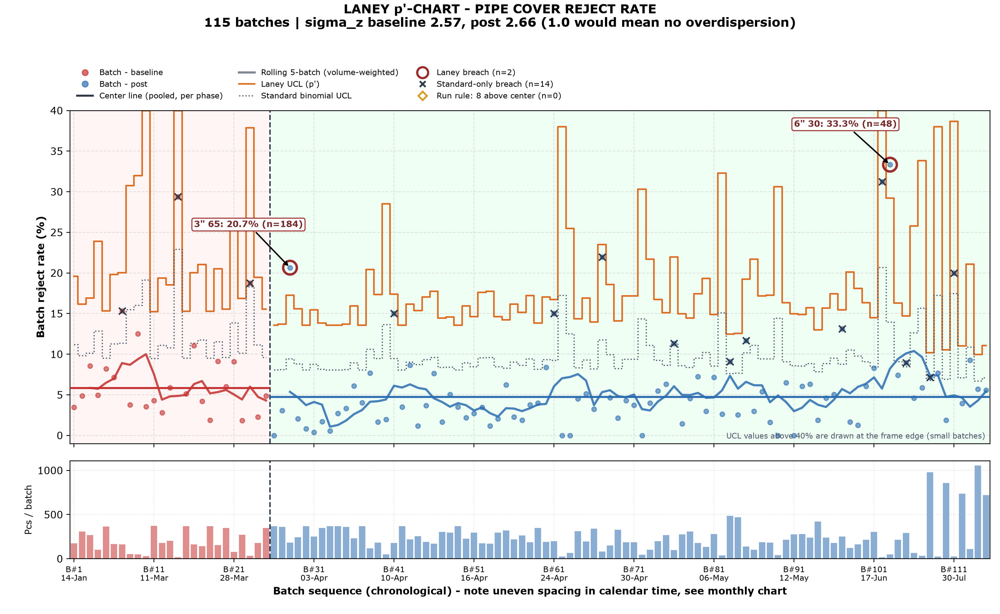
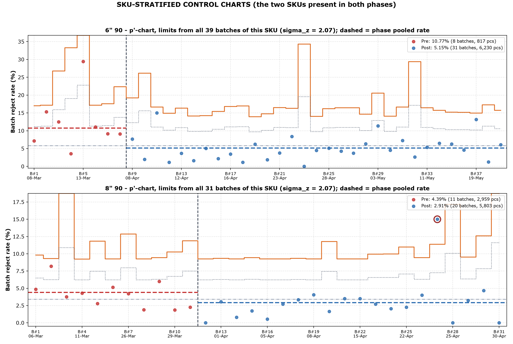
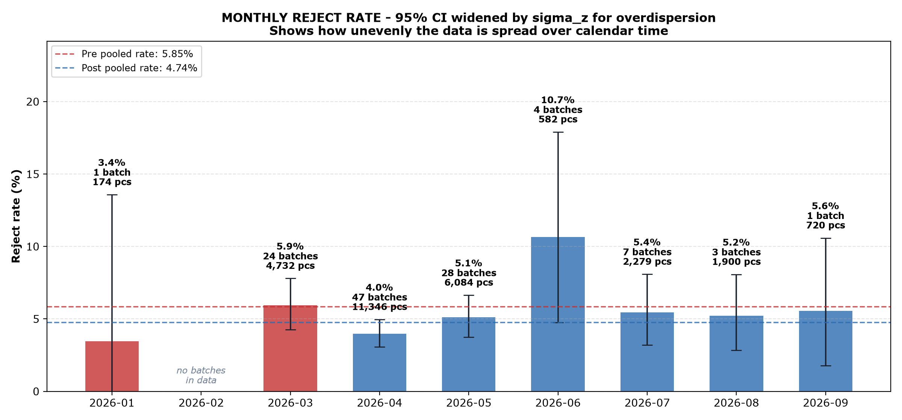
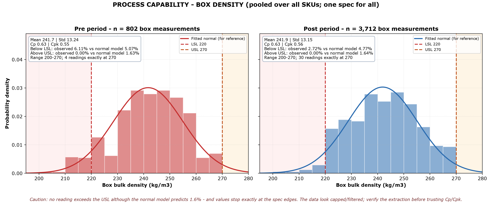
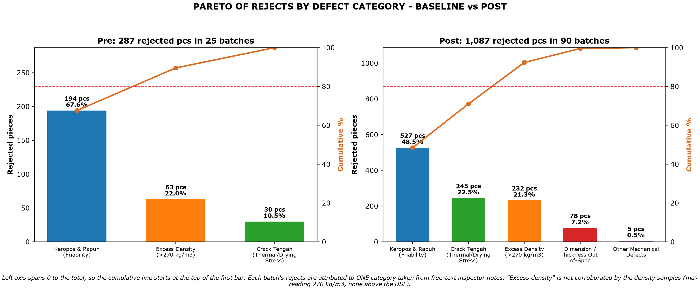

# Statistical Process Control (SPC) & Defect Reduction Engine
## Case Study: Molded Perlite Thermal Insulation Manufacturing (Plant X)

[](https://www.python.org/)
[]()
[]()

Industrial quality control engine and statistical process monitoring pipeline built on **115 empirical manufacturing batches and 4,514 box density measurements** from an industrial perlite insulation facility (Plant X).

The project applies **Laney p'-Control Charts (correcting for overdispersion)**, **Process Capability Analysis (Cp / Cpk)**, **Pareto 80/20 root-cause analysis**, and **normalized Cost of Poor Quality (COPQ) modeling**.

---

## 1. Executive Summary & Observed Production Impact

Evaluation Boundary: On 1 April 2026 (marking Q2 operational reviews), shop-floor directives adjusted target slurry density upward to counteract product friability, accompanied by a marked increase in facility throughput. The evaluation compares **Period 1 (Baseline: Jan–Mar 2026)** against **Period 2 (Post-Intervention: Apr–Sep 2026)**.

| Metric | Baseline | Post | Change | Evidence |
|---|---|---|---|---|
| Window | 2026-01-14 to 2026-03-31 (2 of 3 months have data) | 2026-04-01 to 2026-09-03 (6 of 6 months have data) | - | - |
| Batches / pieces | 25 / 4,906 | 90 / 22,911 | - | - |
| Overall reject rate (pooled) | 5.85% | 4.74% | -18.9% | Naive Z=3.24 (p=0.0012); Laney-adjusted Z=1.24 (p=0.22); 95% CI of drop [-0.64, +2.85] pp; batch-level Mann-Whitney p=0.038 -> **NOT significant after overdispersion adjustment** |
| Average batch reject rate | 7.56% | 5.66% | - | unweighted mean of batches |
| 6" 90 reject rate | 10.77% (8 batches) | 5.15% (31 batches) | -52.2% | Naive Z=6.46; Mann-Whitney p=0.003; bootstrap 95% CI of drop [+2.95, +8.72] pp -> **Significant (CI excludes 0)** |
| 8" 90 reject rate | 4.39% (11 batches) | 2.91% (20 batches) | -33.7% | Naive Z=3.61; Mann-Whitney p=0.037; bootstrap 95% CI of drop [-0.24, +3.05] pp -> **Not significant (CI includes 0)** |
| Scrap cost per piece produced (assumed Rp 45,000/pc) | Rp 2,632 | Rp 2,135 | -18.9% | assumption-based, not measured |

*Note on COPQ:* The scrap cost per piece produced is mathematically identical to the pooled reject rate (-18.9%) because a flat benchmark scrap valuation of Rp 45,000/pc is assumed throughout.

---

## 2. Industrial Problem Statement

In molded perlite thermal insulation manufacturing:
1. **The Friability vs. Density Operational Boundary:** Lightweight expanded perlite is engineered for thermal insulation. When density drops below the lower specification limit (**LSL = 220 kg/m3**), products exhibit acute structural friability: corners chip, edges crumble under manual packaging, and handling scrap spikes (keropos & rapuh, accounting for 67.6% of baseline reject notes).
2. **The Overweight / Excess Density Paradox:** Inspector notes attribute 21.95% of baseline rejects to excess weight/density. However, recorded box densities in the dataset do not exceed 270 kg/m3. This suggests that rejections occurred based on gross unit scale weight (e.g. piece weight > 6 kg) rather than core density, or that recorded density measurements were subject to data-entry truncation at 270 kg/m3 (a hypothesized measurement artifact).
3. **Sporadic High-Defect Batches on Select SKUs:** Two isolated batches exhibited extreme defect rates (>20%): 3" 65 on 2026-04-01 (20.7% reject, n=184) and 6" 30 on 2026-06-24 (33.3% reject, n=48). The underlying root causes remain unverified hypotheses (such as dimensional wall-thickness variance or small-batch setup friction) requiring formal engineering verification.

---

## 3. Technical Pipeline Architecture

```text
[115 Packaged Plant Inspection Records (Plant X)]
   |
   v
[1. SPC Laney Analytics Engine (src/spc_laney_engine.py)]
   |-- Calculates Laney p'-Chart Limits (Baseline sigma_z = 2.57, Post sigma_z = 2.66; order-sensitivity range 2.1–2.7)
   |-- Computes volume-weighted 5-Batch Rolling Moving Averages (partitioned by phase)
   |-- Evaluates Process Capability (Cp, Cpk) across 4,514 Box Density Points
   \-- Robust significance testing: Mann-Whitney, Welch, cluster bootstrap CI
   |
   v
[2. Root Cause & Defect Stratification Engine]
   |-- Pareto 80/20 failure mode classification
   \-- Density distribution mapping vs specification boundaries (220 - 270 kg/m3)
   |
   v
[3. Analytical SQL Warehouse Layer (sql/anonymized_qc_views.sql)]
   |-- SQLite database (data/processed/industrial_qc.db)
   |-- Window Functions for cumulative defect ranking per phase
   \-- Volume-weighted 5-batch rolling quality tracking & fixed-threshold flags
   |
   v
[4. Executive Decision Memo & Visual Dashboards]
   |-- Illustrative Quality Engineering Memo (dashboard/EXECUTIVE_BUSINESS_MEMO.md)
   \-- Publication-grade 200 DPI visual artifacts (dashboard/*.png)
```

---

## 4. Key Visualizations

### A. Statistical Process Control: Laney p'-Chart (Facility Overview)

* **Overdispersion Correction:** The standard binomial model would trigger 13 false alarms. Adjusting for overdispersion (baseline sigma_z = 2.57, post sigma_z = 2.66) widens the control limits to match natural batch-to-batch variation.
* **True Assignable Causes:** Only 2 batches breach the upper Laney control limit (UCL p'): Batch 3" 65 (20.7% reject, n=184) and Batch 6" 30 (33.3% reject, n=48).
* **Run Rule Evaluation:** Checking for 8 consecutive points above the center line yielded **0 signals** in both phases, confirming the absence of sustained one-sided process shifts.

### B. SKU-Stratified Control Charts (6" 90 & 8" 90)

* Stratifying by product line confirms that the reject drop on **6" 90** (10.77% down to 5.15%) is robust and statistically significant.
* For **8" 90**, the reject drop (4.39% down to 2.91%) is not statistically significant once batch clustering is accounted for.

### C. Monthly Defect Distribution & Calendar Clustering

* Exposes the pronounced calendar concentration: 24 of 25 baseline batches occurred in March (February has zero data), while 75 of 90 post-intervention batches occurred in April and May, followed by low volumes (1–7 batches/month) from June through September.
* 95% confidence intervals are inflated by sigma_z to reflect genuine batch clustering.

### D. Box Bulk Density Capability & Truncation Diagnostics

* Evaluates 4,514 box-level bulk density readings (802 baseline, 3,712 post-intervention).
* **Process Centering:** Baseline mean (241.70 kg/m3) and post mean (241.93 kg/m3) are nearly identical.
* **Capability Indices:** Cp = 0.63 and Cpk = 0.55 (baseline) vs. Cp = 0.63 and Cpk = 0.56 (post). Natural process variation (6-sigma ≈ 79 kg/m3) exceeds the 50 kg/m3 specification spread.
* **Data Truncation Warning:** Observations terminate exactly at 200.0 and 270.0 kg/m3 with zero readings beyond spec, indicating artificial boundary clipping during data entry.

### E. Aligned Pareto Defect Analysis (Pre vs. Post)

* Baseline scrap was dominated by *Keropos & Rapuh* (67.6%) and *Excess Density* notes (21.95%).
* Post-intervention defect distribution shows reduction in friability notes on mature runs.

---

## 5. Analytical SQL Layer

The pipeline compiles clean metrics into SQLite (`data/processed/industrial_qc.db`) equipped with 5 specialized analytical views:
* `view_executive_quality_summary`: Summary of batch count, volume, rejects, reject percentages, and assumed COPQ grouped by phase.
* `view_sku_defect_performance`: Performance breakdown stratified by SKU dimension and phase.
* `view_pareto_failure_modes`: Cumulative defect ranking partitioned by phase using SQL Window Functions (`SUM() OVER (...)`).
* `view_rolling_batch_quality`: Volume-weighted 5-batch rolling moving average (`WINDOW w AS (PARTITION BY phase ORDER BY date, rowid ROWS BETWEEN 4 PRECEDING AND CURRENT ROW)`) with operational fixed-threshold flags (>15% elevated, >30% severe; distinct from Laney limits).
* `view_monthly_quality`: Monthly aggregations highlighting calendar-month volume shifts and batch clustering.

---

## 6. Methodological Limitations & Data Caveats

1. **Quasi-Experimental Design Without Control:** The comparison relies on observational historical data before and after 1 April 2026. Without a concurrent control group, external factors cannot be ruled out.
2. **Extreme Calendar & Throughput Clustering:** 
   - Baseline: 24 of 25 batches are concentrated in March 2026 (January has 1 batch, February has none).
   - Post-Intervention: 75 of 90 batches are clustered in April (47) and May (28), with only 15 batches spread across June through September.
   - Plant throughput expanded by +367%, confounding intervention effects with potential scale economies and SKU mix changes.
3. **Density Measurement Truncation & Lack of Distribution Shift:** 
   - Recorded densities show severe artificial truncation at 200.0 and 270.0 kg/m3.
   - Mean and standard deviation are virtually unchanged (Cpk 0.55 vs 0.56), showing no empirical evidence that slurry density distribution shifted.
4. **Sensitivity of Laney Sigma_z to Within-Day Batch Order:** 
   - 52 batches share dates with other batches. Moving-range calculation of sigma_z varies between 2.1 and 2.7 depending on row order.
   - However, the statistical conclusion (overall plant defect drop is not statistically significant) holds true across the entire range (most favorable p-value = 0.15).
5. **Single Defect Attribution:** Each batch's scrap is assigned to exactly one primary category derived from inspector free-text logs.
6. **Small Baseline Sample on Primary SKU:** The baseline for SKU 6" 90 contains only 8 batches (817 pieces).
7. **Assumption-Based COPQ:** Scrap costs use a fixed assumption of Rp 45,000/pc; consequently, percentage COPQ savings (-18.9%) are mathematically identical to the pooled reject reduction.

---

## 7. How to Reproduce

### 1. Environment Setup
```bash
# Clone the repository
git clone https://github.com/Lottoenergon/industrial-spc-engine.git
cd industrial-spc-engine

# Create virtual environment & install dependencies
python -m venv .venv
# On Windows:
.venv/Scripts/activate
# On Linux / macOS:
# source .venv/bin/activate

pip install -r requirements.txt
```

### 2. Run Pipeline & Rebuild Database
```bash
# Runs data validation, Laney SPC engine, chart generation, and SQLite view refresh
python run_pipeline.py
```

---

## Author & Contact
* **Afiatta Ilhan Saleh**
* LinkedIn: [https://www.linkedin.com/in/afiatta-ilhan-922991227/](https://www.linkedin.com/in/afiatta-ilhan-922991227/)
* Email: afiattailhan.ai@gmail.com
